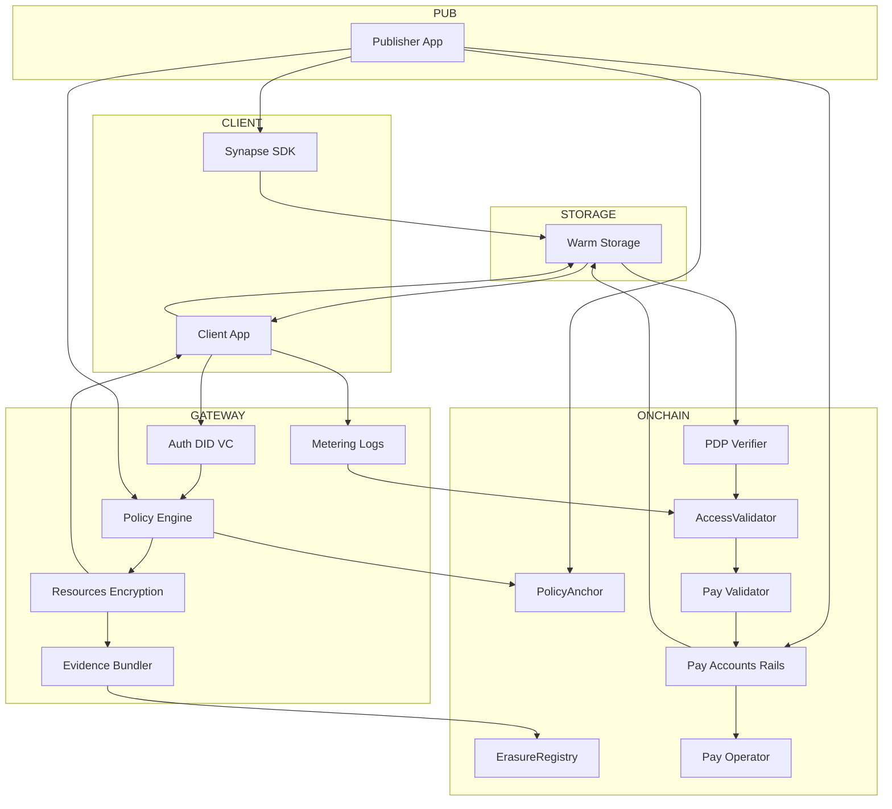

# Access Control & Compliance (ACC) Service

## Why do we want to build this

As Filecoin becomes composable decentralized cloud, it needs reusable on-chain access control + compliance layer that any builders can stop re-implementing:
- IAM(Identity & Access Management)
- Data lifecycle & expiry rules
- GDPR logic from scratch(current erasure process is bad with no cryptographic proof of key destruction, no standard retention/expiry flow, no audit receipts)

## Overview

Portable, on-chain policy + compliance layer that any Filecoin Service (warm storage, retrieval, compute-over-data) can call to: 
- (1) grant/revoke access
- (2) take GDPR style erasure actions with cryptographic erasure and auditable receipts
- (3) handle pay per access using Filecoin Pay rails

### What we’re building

#### Smart contract layer (FVM)

ACC Service Contract (Solidity on FVM):

- PolicyAnchor: minimal on-chain registry mapping resourceCID (or CommP) → current PolicyID and status(Active/Revoked/Erased).

- AccessValidator (Filecoin Pay-compatible): called during settleRail(). It checks a signed AccessReceipt from the off-chain gateway (contains policy decision, metering counters, PDP status, and payer/payee IDs). If valid, it authorizes payout; if not, it reduces/zeroes settlement. 

- ErasureRegistry: emits and stores ErasureReceipt records (hash-linked to evidence bundle in warm storage), with fields for key-destruction attestations, policy revocation time, index de-listing proofs, and validator signatures. That by itself grounds GDPR Art. 17 workflows.

#### Developer Experience

- **TypeScript SDK:** built on Synapse SDK to: 
  - (a) register resources and policies
  - (b) request access tokens/receipts
  - (c) stream payments
  - (d) trigger erasure. Provides drop-in usage for React web apps 
- Policy kits (“recipes”):
  - Purpose-bound read: “Allow physician with VC:role=‘doctor’ & country=‘EU’ to read MRI for 24h. Deny re-share.”
  - Fair-use analytics: “Allow LLM to read 100 docs/day under paid license.”

#### How it composes with Filecoin:

- Uses Filecoin Pay rails, and validator veto to tie money to policy-compliant reads/writes. 

### Lifecycle Flows

- Grant access
  - Publisher uploads data via FS warm storage. Gateway encrypts and registers PolicyAnchor on-chain
  - Publisher funds USDFC and approves ACC as Operator (Filecoin Pay) to create a rail to the Service Provider
  - Requester presents verifiable credentials(e.g. KYC / age / geo) with selective disclosure
- Read / Settle
  - Requester fetchesdata, gateway validates PDP status
- Revoke / Modify
  - Controller updates policy (e.g., access is expired or price is raised)
 

 
## Roadmap

1. Product Design
2. Creating Specs
   - Researching on current state of PDP, WarmStorageService, Filecoin Pay
   - Detailed scope for architecture of on-chain and off-chain components
   - Research for encryption that will be used for encrypting / reencrypting / erasure
   - Specs for ready to use Policy Kits based on Verifiable Credentials access
3. Proof Of Concept
   - On-chain `PolicyAnchor`
   - Typescript wrapper around Synapse SDK for request access to data / accessing data based on Verifiable Credentials
   - MVP for erasure mechanism
4. Further Development
   - On-chain `ErasureRegistry` with proof of erasure

